## Tổng Quan Màn Hình

Khi lần đầu tạo farm, bạn sẽ thấy giao diện chính với các khu vực sau:

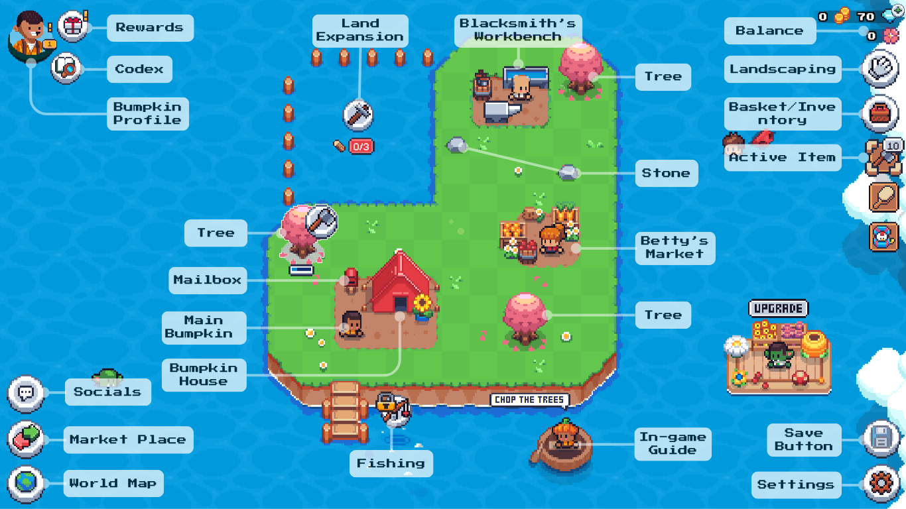

### Góc Trên-Trái: Bumpkin Portrait

Bumpkin portrait là menu chính, chứa:
- **Bumpkin Profile** — xem level, XP, stats, equipment
- **Calendar** — theo dõi season hiện tại, upcoming seasons, weather events
- **Chapter Dashboard** — Chapter Pass progress, tasks, tickets

### Góc Phải: Quick-Select Bar

3 items gần đây nhất được chọn. Khi chọn seed từ Market hoặc Basket, nó xuất hiện ở đây. Click để chọn active item.

> **Không có confirmation khi plant** — hãy chắc chắn chọn đúng seed!

Tắt quick-select qua: Game Options → General Settings → Preferences → Quick Select

### Góc Dưới-Trái: Map (Travel)

Mở Map để travel đến các zones đã mở khóa. **Travel là miễn phí, không tốn phí.** Dùng arrow keys, WASD, hoặc pointer dưới màn hình để di chuyển trong zone.

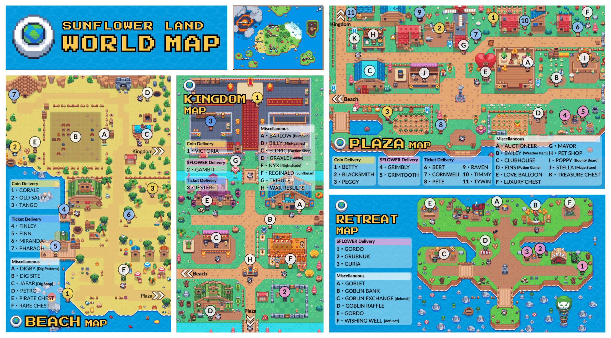

---

## Zones & Travel

### Home (Farm của bạn)

Nơi bạn dành phần lớn thời gian. Scroll để xem các góc land. **Không thể walk around** như các zones khác.

Buildings có sẵn:

| Building | Chức năng |
|----------|-----------|
| **House** | Chứa furniture, decorations, NPC deliveries |
| **Fire Pit** | Cooking cơ bản |
| **Blacksmith** | Craft tools, workbench, buildings |
| **Market** (Betty) | Mua seeds, bán crops |

**Buildings cần xây:**

| Building | Yêu cầu | Chức năng |
|----------|---------|-----------|
| Water Well | Basic | Plot fertility (tối đa Lv4) |
| Kitchen | Basic | Cooking nâng cao |
| Crafting Box | Basic | Craft items cho deliveries |
| Compost Bin | Basic | Sprout Mix + Earthworms |
| Bakery | Basic | Bánh cakes |
| Deli | Basic | Cheese + food types |
| Hen House | Petal Island | Chickens |
| Barn | Petal Island | Cows & Sheep |
| Greenhouse | Desert Island | Rice, Olive, Grape (cần Oil) |
| Crop Machine | Desert Island | Auto farming (cần Oil) |

> **Lưu ý:** Water Well và Hen House trước đây có thể xây nhiều cái. Hiện tại chỉ cần **1 cái**, upgrade được. Extra có thể bán tại Garbo.

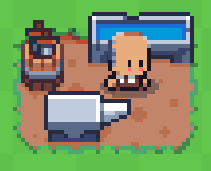

### Plaza (Pumpkin Plaza)

Mở khóa từ đầu. NPCs cho deliveries, Mega Bounty Board, Stella's Megastore, Potion Room, keyed treasure chests. Pet shop sắp ra mắt.

### Beach (Lvl 4)

NPCs deliveries + Finn (master fisher, bán Fishing Lures). Dig Site — đào treasures.

**Digging Hotspot:** Đưa đến Beach tại lối vào gần Jafar's shop và Dig Site.

### Retreat (Lvl 5)

Goblins — đổi food lấy $FLOWER. Goblet (trash→treasure), Garbo (mua bán đồ cũ). Goblin với Wallet Icon — mint farm + store on chain.

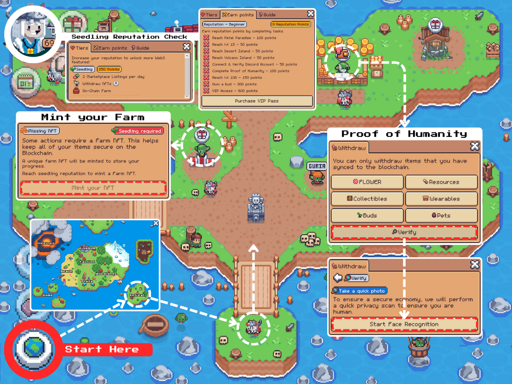

### Kingdom / Faction (Lvl 7)

Faction War! Gia nhập 1 trong 4 Factions — earn Marks, rewards. Faction House (teleport trực tiếp). Royal NPCs deliveries.

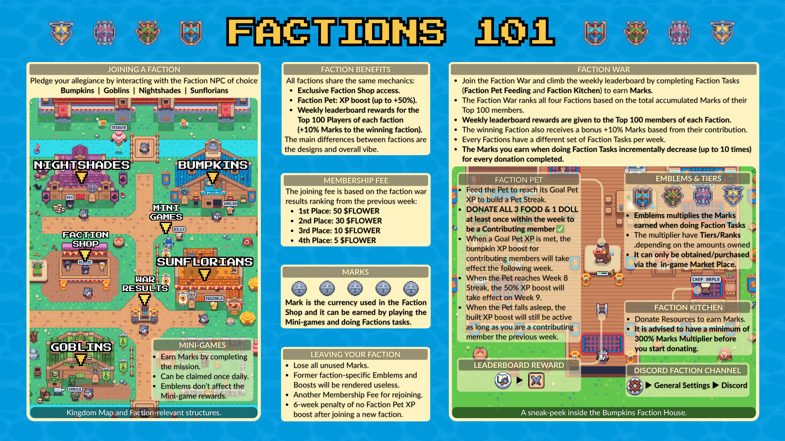

### Infernos (Lvl 30)

Volcanic land — red-skinned goblins, trade sunstone & obsidian.

---

## Cooking & Leveling

Click vào Bumpkin (trước House) → chọn food → eat → nhận XP. Level up mở khóa features + expansions.

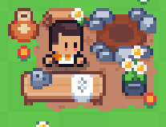
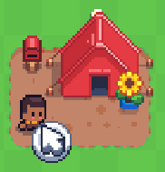

### Timer

Số đếm ngược hiển thị trên mỗi plot. Green bar thể hiện trực quan. Tắt qua: **Game Options → General Settings → Preferences → Timers**. Click/tap plot để xem thời gian chính xác.

---

## Market Interface

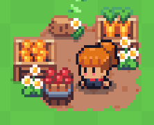

### Buy Tab
- Seeds được tổ chức theo **type order** (Basic → Medium → Advanced)
- Chọn seed → xem type, growth time, season, price
- Mỗi season chỉ bán seeds compatible

### Guide Tab
- Xem thông tin chi tiết từng crop

### Restock
- **Daily Shipment:** Free, số lượng nhỏ
- **Gem Restock:** Restock seeds/tools cần Gems

---

## Skills & Specialization

1 skill point mỗi Bumpkin level. Allocate cẩn thận.

- **Free skill reset:** 1 lần, lần tiếp theo sau 180 ngày
- **Gem reset:** Chi phí tăng dần

Key farming skills:

| Skill                  | Effect                         |
| ---------------------- | ------------------------------ |
| **Young Farmer**       | Basic +0.1                     |
| **Experienced Farmer** | Medium +0.1                    |
| **Old Farmer**         | Advanced +0.1                  |
| **Strong Roots**       | Advanced −10% time             |
| **Acre Farm**          | Advanced +1, Basic/Medium −0.5 |
| **Hectare Farm**       | Basic/Medium +1, Advanced −0.5 |

Xem thêm: [[skills]]

---

## Giao diện phụ

### Calendar & Seasons

Sau Petal Island (14 ngày đồng bộ), theo dõi:
- **Unknown Events:** Positive (Sunshower, Bountiful Harvest) hoặc Negative (Tornado, Freeze)
- **Full Moon:** Fish special
- **Double Delivery Day:** ×2 rewards

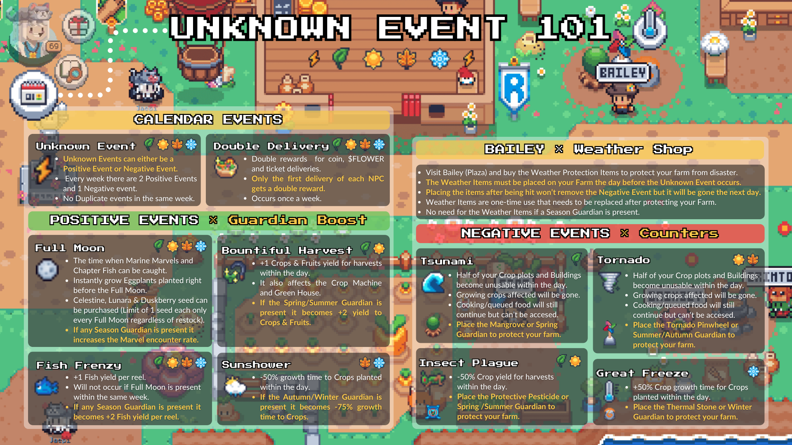

### Gift Giver & Town Hall

**Gift Giver:** Players (Devs/Admins) với Gift/Love Charm icon. Xuất hiện random → interact nhận Gift.

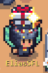

**Town Hall:** https://sunflower-land.com/play/#/world/stream (chỉ available trong weekly Dev Livestream)

### Mini Games

Billy tại Kingdom (Lvl 7) — earn Marks miễn phí.

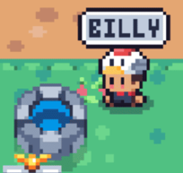

### Landscaping Mode

Rearrange và decorate farm. Biomes = "skin" thay đổi appearance. Chỉ mua được Prestige đã đạt.

---

## Shortcut Tips (Travel Map)

| Điểm đến | Teleport tới | Sau đó |
|-----------|-------------|--------|
| **Faction Shop** | Digging Site | Đi bộ sang phải → Kingdom |
| **Raven/Tywin** | Kingdom | Đi xuống dưới → Plaza |
| **Minigame Portal** | Bumpkins Faction House | Đi ra cửa trước |
| **Gambit** | Kingdom | Đi bộ lên trên |
| **Bert/Timmy/Betty** | Woodlands | Đi bộ sang trái → Plaza |

---

> **Nguồn:** Travel Map (librophagus), Guide Draft (Jaepi, Haesoo, iSPANK, librophagus), Home Island (librophagus)
