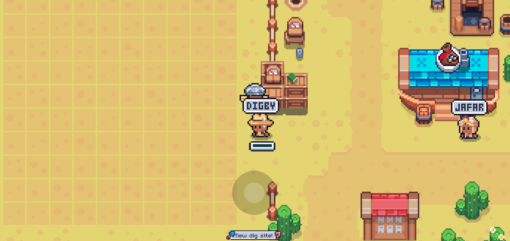

# Dig Site

*Ảnh: What will you dig up?*

Vô số kho báu đang chờ đợi bên dưới lớp cát di động ở phần trên của Bãi biển. Hãy lấy vài cái xẻng và bắt đầu khai quật, rồi tận hưởng phần thưởng hậu hĩnh!

## Vị trí & Cách đến Dig Site

Dig Site nằm ở phần **trên cùng** của khu vực Bãi biển (Beach).

**Lộ trình nhanh từ Home:**
1. Di chuyển đến **Beach** → bạn sẽ ở lối ra dưới cạnh **Corale**
2. Teleport đến **Kingdom** → bạn sẽ ở lối ra cạnh **Mark Shop**
3. Đi bộ sang **trái** → đến trước cửa tiệm của **Jafar**

## NPC quản lý

| NPC | Vai trò |
|---|---|
| **Jafar** | Chế tạo Sand Shovel & Sand Drill; mua lại kho báu bằng Coins |
| **Digby** | Giám sát Dig Site; đưa ra manh mối (clues) về vị trí kho báu |

## Công cụ Đào (Digging Tools)

### Sand Shovel (Xẻng Cát)
- **Tác dụng:** Khai quật **1 ô vuông** duy nhất trên lưới
- **Nguyên liệu:** 2 Wood + 1 Stone mỗi cái
- **Tồn kho mỗi lần restock:** 50 cái
- **Miễn phí hàng ngày:** 5 xẻng (bao gồm trong restock miễn phí)
- **Chi phí restock riêng:** chỉ **5 Gems** (không ảnh hưởng stock farm khác)
- **Lưu ý quan trọng:**
  - Tòa **Toolshed** trên Home Island **không** tăng số xẻng mỗi restock
  - Tùy chọn **Workbench Restock** cũng **không** bổ sung công cụ đào

### Sand Drill (Máy Khoan Cát)
- **Tác dụng:** Khai quật vùng **2×2 ô** cùng lúc
- **Nguyên liệu:** Oil, Crimstone, Wood, và Leather (khá đắt)
- **Tồn kho mỗi lần restock:** chỉ 10 cái
- Có thể nhận thêm từ phần thưởng hoặc rương (chests)

## Lưới Dig Site

- Kích thước: **10×10 ô vuông**
- Vào qua lỗ hở ở hàng rào bên trái (gần Old Salty) hoặc bên phải (gần Digby)
- **Truy cập độc quyền:** Pharaoh đã yểm phép cổ đại → khi bạn vào, tất cả người chơi khác bị đẩy ra rìa hàng rào. Khi bạn rời đi, họ xuất hiện lại vị trí thực.
- Vị trí kho báu **duy nhất cho mỗi người chơi** — không thể mách bạn bè cùng vị trí được.

### Quy tắc đào cơ bản

| Phát hiện | Ý nghĩa | Hành động |
|---|---|---|
| **Crab** (Cua) | Có kho báu khác ở ô **liên kề** theo chiều dọc/ngang (trên, dưới, trái, phải) | **Đào xung quanh** ô có Crab |
| **Sand** (Cát) | **Không** có gì ở các ô liên kề | **Đào chỗ khác** |

> **Tóm tắt:** Crab → đào lân cận; Sand → bỏ đi tìm chỗ mới.

## Kho báu (Treasures)

Mọi thứ trong tab **Sell** tại cửa hàng Jafar đều có thể đào được. Nhiều vật phẩm cũng xuất hiện ở Fishing treasures.

**Lưu ý khi bán:**
- Nhiều vật phẩm cần thiết cho **deliveries** (đơn hàng) → giữ lại vài cái mỗi loại
- **Seaweed** (Rong biển) → nấu tại Firepit thành thức ăn hữu dụng
- Một số kho báu → chuyển đổi thành **Salt** tại **Aging Shed**
- Có thể bán lấy Coins khi không cần

### Chapter Artifacts
- Thay đổi mỗi **Chapter** mới
- Thấy artifact từ Chapter trước trong shop, và artifact Chapter sắp tới khi Chapter hiện tại gần kết thúc
- **Giữ càng nhiều càng tốt** → nộp tại **Megastore**
- Chỉ bán khi Chapter kết thúc hoặc đã mua hết vật phẩm đổi được

## Manh mối của Digby (Digby's Clues)

Digby khảo sát khu vực mỗi ngày và cung cấp manh mối về vị trí kho báu, đặc biệt là **Chapter Artifacts**.

**Cách nhận manh mối:**
- Nói chuyện với Digby trong game
- Nhấn nút **"New Dig Site!"** ở cuối màn hình
- Truy cập tab **Treasures** tại https://sfl.world/land/ (nhập Farm ID)

**Patterns (Mẫu):**
- Các mẫu **nhất quán và lặp lại** — ví dụ:
  - Luôn tìm thấy 2 bình hoa (vases) với hình chữ tượng hình bên dưới bình trái
  - 3 dưa biển (sea cucumbers) liên tiếp với pipi ở ngoài cùng bên phải
- Học thuộc patterns → đào nhanh hơn, hiệu quả hơn
- Có thể tìm thấy vật phẩm khác ngoài patterns → tiếp tục đào!

**Phần thưởng Digby Bonus:**
- Đào đủ **3 Artifacts trong 1 ngày** → Digby tặng **phần thưởng bonus**
  - Artifact thứ 4
  - Thêm 1 vật phẩm ngẫu nhiên
- Xây dựng **chuỗi ngày liên tiếp (daily streak)** → phần thưởng ngày càng tốt hơn
- Xem Desert Streaks tại: https://sfl.world/info/chests

## Giới hạn Đào (Dig Limit)

- Có **giới hạn số lần đào mỗi ngày** (giống nhiều hoạt động khác trong game)
- **Tăng giới hạn** qua các vật phẩm đặc biệt:
  - Một số đổi được với **Jafar**
  - Số còn lại mua trên **Marketplace**
- Hiện tại **không có skill nào** ảnh hưởng đến digging
- **Reset lúc nửa đêm UTC** (cùng thời điểm reset nhiều thứ khác)

### Mua thêm lượt đào
- Nếu thật sự cần thêm, có thể dùng **Gems** để thuyết phục Digby cho thêm vài lượt đào

## Chiến lược Tối ưu

1. **Ưu tiên đào xung quanh Crab**, bỏ qua vùng Sand lớn
2. **Học thuộc Digby's Clues patterns** → đào nhanh, tiết kiệm lượt
3. **Đào đủ 3 Artifact/ngày** để nhận bonus từ Digby + streak rewards
4. **Dùng Sand Drill cho vùng có nhiều Crab chụm lại** → hiệu quả 2×2
5. **Giữ Chapter Artifacts** cho đến khi Chapter kết thúc hoặc đổi xong tại Megastore
6. **Restock 5 Gems** khi cạn shovel → rẻ, không ảnh hưởng stock farm
7. **Kiểm tra sfl.world/land** thường xuyên để xem manh mối mới
8. **Đừng bán vội** — nhiều vật phẩm cần cho deliveries hoặc chuyển Salt

---

*Cập nhật: 2026-06-01 | Nguồn: [wiki.sfl.world](https://wiki.sfl.world/en/mechanics/digging)*
*Contributors: librophagus (primary content), iSPANK (tagging)*
