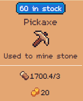
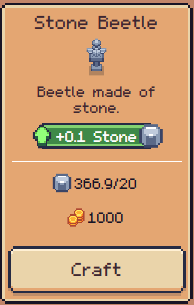
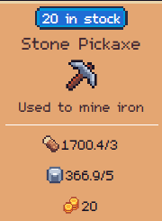
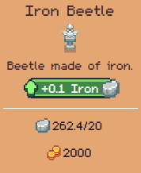
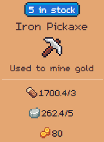
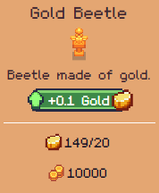
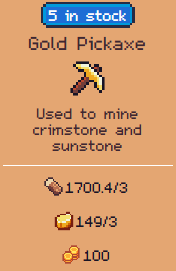
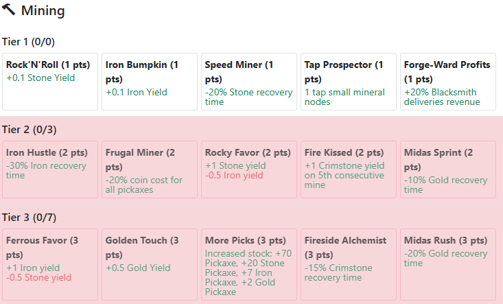

> [!info] Trang này thảo luận về **node forging (grouping)** — một tính năng sắp tới có thể thay đổi trước khi ra mắt chính thức.

## Tổng quan

**Mining** là cơ chế cốt lõi để thu thập khoáng sản có giá trị, phục vụ nhiều mục đích:

- Tạo cần câu (fishing rods)
- Chế tạo pickaxes để khai thác khoáng sản
- Xây dựng oil drills để khai thác dầu
- Sử dụng khoáng sản để mở rộng đất đai
- Sử dụng khoáng sản để xây dựng hoặc nâng cấp công trình
- Sử dụng khoáng sản để đổi SFTs từ blacksmith
- Chế tạo shovels và drills để tìm kho báu trên bãi biển
- Hoàn thành các đơn hàng (deliveries)

> Nói ngắn gọn: cần phải mine (hoặc mua khoáng sản từ market) để tiến bộ trong game hoặc tham gia các hoạt động trên.

### Quy trình cơ bản

```
Chặt cây → gỗ → Pickaxe → Stone
Stone → Stone Pickaxe → Iron
Iron → Iron Pickaxe → Gold
Gold → Gold Pickaxe → Crimstone / Sunstone
```

---

## Stone


*Cost và restock của Pickaxe*

Để có được **Stone**, cần chế tạo **Pickaxe** (loại cơ bản) để khai thác **Stone Rock**.

### Mở khóa thêm Stone Rock nodes

Khi tiến xa hơn, **Sunstone** có thể dùng để mở khóa thêm Stone Rock nodes:

|| Node | Chi phí ||
|------|---------|
| Node đầu tiên | 4 Sunstone |
| Mỗi node tiếp theo | +3 Sunstone |

### Node Forging — Fused & Reinforced Stone Rock

Sắp tới có thể **gom nhóm Stone Rocks** lại để thu được nhiều stone hơn và tiện lợi hơn khi mining:

- **Fused Stone Rock** — nhóm 2 Stone Rock
- **Reinforced Stone Rock** — nhóm 3 Stone Rock

> [!tip] Mẹo cho người mới
> Hãy lấy **Stone Beetle** từ blacksmith càng sớm càng tốt — tăng hiệu quả mining stone.



---

## Iron


*Cost và restock của Stone Pickaxe*

Để có được **Iron**, cần chế tạo **Stone Pickaxe** để khai thác **Iron Rock**.

### Mở khóa thêm Iron Rock nodes

| Node | Chi phí |
|------|---------|
| Node đầu tiên | 7 Sunstone |
| Mỗi node tiếp theo | +5 Sunstone |

### Node Forging — Refined & Tempered Iron Rock

- **Refined Iron Rock** — nhóm 2 Iron Rock
- **Tempered Iron Rock** — nhóm 3 Iron Rock

> [!tip] Mẹo
> Hãy lấy **Iron Beetle** từ blacksmith để tăng hiệu quả mining iron.



---

## Gold


*Cost và restock của Iron Pickaxe*

Để có được **Gold**, cần chế tạo **Iron Pickaxe** để khai thác **Gold Rock**.

### Mở khóa thêm Gold Rock nodes

| Node | Chi phí |
|------|---------|
| Node đầu tiên | 10 Sunstone |
| Mỗi node tiếp theo | +6 Sunstone |

### Node Forging — Pure & Prime Gold Rock

- **Pure Gold Rock** — nhóm 2 Gold Rock
- **Prime Gold Rock** — nhóm 3 Gold Rock

> [!tip] Mẹo
> Hãy lấy **Gold Beetle** từ blacksmith để tăng hiệu quả mining gold.



---

## Crimstone


*Cost và restock của Gold Pickaxe*

Để có được **Crimstone**, cần chế tạo **Gold Pickaxe** để khai thác **Crimstone Rock**.

### Mở khóa thêm Crimstone Rock nodes

| Node | Chi phí |
|------|---------|
| Node đầu tiên | **20 Sunstone** |
| Mỗi node tiếp theo | **+20 Sunstone** |

> Crimstone là khoáng sản cao cấp — chi phí mở khóa node rất đắt so với các loại khác.

---

## Mining Skills

Cây kỹ năng mining cho phép xây dựng chiến lược tối ưu hóa việc khai thác. Dưới đây là các hướng build phổ biến:

### Stone Specialist
```
Rock'N'Roll → Speed Miner → Forge-Ward Profits → Frugal Miner → Rocky Favor
```
Tập trung tối đa hóa sản lượng và tốc độ mining stone.

### Iron Specialist
```
Rock'N'Roll → Iron Bumpkin → Forge-Ward Profits → Frugal Miner → Iron Hustle → Ferrous Favor
```
Tối ưu hóa mining iron, kết hợp một số skill chung với Stone Specialist.

### Gold Specialist
Có thể dùng setup Stone hoặc Iron Specialist (hoặc kết hợp cả hai nếu muốn chơi toàn diện), sau đó thêm:
- **Golden Touch**
- **Midas Sprint**
- **Midas Rush**

### Crimstone Specialist
Có thể dùng setup Stone hoặc Iron Specialist (hoặc kết hợp cả hai), sau đó thêm:
- **Fire Kissed**
- **Fireside Alchemist**


*Cây kỹ năng Mining đầy đủ*

---

## Bảng tổng hợp nhanh

| Khoáng sản | Pickaxe cần | Unlock node đầu | Unlock/node tiếp | Node Forging |
|------------|-------------|-----------------|------------------|--------------|
| **Stone** | Pickaxe | 4 Sunstone | +3 | Fused → Reinforced |
| **Iron** | Stone Pickaxe | 7 Sunstone | +5 | Refined → Tempered |
| **Gold** | Iron Pickaxe | 10 Sunstone | +6 | Pure → Prime |
| **Crimstone** | Gold Pickaxe | 20 Sunstone | +20 | — |

