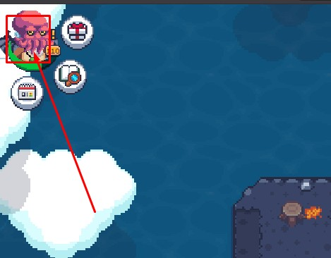
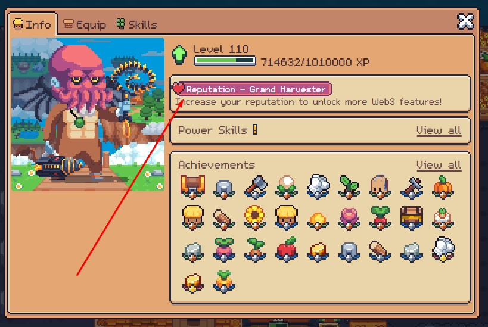
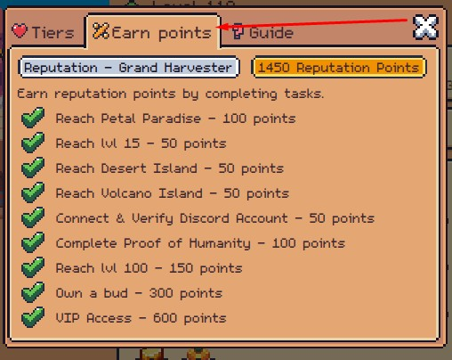

## Giới thiệu

Reputation là một hệ thống được các nhà phát triển triển khai nhằm chống lại "kẻ xấu", "người dùng đa tài khoản" và "bot". Hệ thống này hướng tới việc chỉ cho phép **NGƯỜI THẬT** chơi game và hưởng lợi từ các tính năng nhất định. Hệ thống này đã thành công về tổng thể, vì hoạt động bot vốn từng tràn lan đã phần lớn giảm bớt.

> [!info] Mục đích chính
> Reputation là cơ chế **chống bot** — không phải hệ thống tiến trình thông thường. Điểm không thể "farm" mà phải đạt được qua việc chứng minh bạn là người chơi thật.

## Cách kiếm điểm Reputation

Điểm reputation có thể đạt được bằng nhiều cách:

| Thành tựu | Điểm | Ghi chú |
|---|---|---|
| Đạt Petal Paradise (Đảo Mùa Xuân) | +100 | Hòn đảo thứ 3 trong chuỗi đảo chính |
| Đạt cấp 15 | +50 | Mốc cấp độ sớm |
| Đạt Desert Island (Đảo Sa Mạc) | +50 | Hòn đảo sa mạc |
| Đạt Volcano Island (Đảo Núi Lửa) | +50 | Hòn đảo núi lửa |
| Kết nối & xác minh Discord | +50 | Liên kết tài khoản Discord và xác minh qua bot |
| Xác minh qua Telegram | +50 | Xác minh qua @pumpkin_pete_bot (tính năng mới) |
| Hoàn thành Proof of Humanity | +100 | Xác minh danh tính người thật (face verification) |
| Đạt cấp 100 | +150 | Mốc cấp độ cao |
| Sở hữu một Bud | +300 | NFT pet — cách nhanh nhất nhưng tốn kém |
| VIP Access | +600 | Mất điểm nếu VIP hết hạn |

> [!warning] Điểm VIP có thể mất
> Nếu trạng thái VIP hết hạn, bạn sẽ **mất 600 điểm** này và có thể rớt xuống hạng thấp hơn.

**Tổng điểm tối đa có thể đạt (hệ thống hiện tại): 1,450 điểm**

> [!info] Hệ thống mới được đề xuất (GitHub Discussion #4976 - Dec 2024)
> Team dev đã đề xuất một hệ thống Reputation mới với 5 tier (Tier 1-5) thay vì 3 hạng hiện tại. Hệ thống này bao gồm: Twitter verification (+100), Discord verification tăng lên +100, Volcano Island +100, và các tier mới: Tier 2 (250pts), Tier 3 (350pts), Tier 4 (600pts), Tier 5 (800pts). **Hiện chưa triển khai** — Wiki (cập nhật 10/12/2025) vẫn phản ánh hệ thống 3 hạng hiện tại. Xem chi tiết mục [Hệ thống đề xuất](#h%E1%BB%87-th%E1%BB%91ng-%C4%91%E1%BB%81-xu%E1%BA%A5t-t%E1%BB%AB-github-discussion-4976).

## Các hạng Reputation và quyền lợi

Tại một số "cột mốc" điểm reputation nhất định, bạn sẽ có khả năng làm được nhiều việc hơn trong game.

### 🌱 Seedling — 250 điểm

- 2 Marketplace Listings mỗi ngày
- Rút NFTs (đồ trang trí và wearable)
- Khả năng Mint Farm Của Bạn (cung cấp cho bạn token NFT đại diện cho quyền truy cập farm. Cũng cho phép "Store on Chain" — quy trình cần thiết để vượt quá giới hạn lưu trữ cho một số vật phẩm)

### 🌿 Grower — 350 điểm

- 3 Marketplace Listings mỗi ngày
- Rút $FLOWER
- Truy cập Auction

### 🌾 Cropkeeper — 600 điểm

- Tạo & Chấp nhận Offers
- Không giới hạn Listings & Offers
- Mở khóa tất cả $FLOWER Deliveries
- Rút Resources (crops, fruits, v.v.)

## Cách kiểm tra điểm Reputation

1. Nhấp vào **biểu tượng hồ sơ** ở góc trên bên trái màn hình
2. Nhấp vào **"nút reputation"**
3. Nhấp vào **"Earn Points"** trong tab trên cùng để xem điểm của bạn và những gì bạn cần làm để kiếm thêm

## Hướng dẫn xác minh Telegram (Telegram Verification)

Theo trang [Verification](https://wiki.sfl.world/en/mechanics/verification) (cập nhật 12/07/2025), hiện có thể xác minh qua Telegram:

1. **Mở bot**: Truy cập https://t.me/pumpkin_pete_bot
2. **Gửi lệnh**: Gõ `/verify` (bao gồm dấu `/`) và gửi
3. **Hoàn tất trong game**: Quay lại game, thực hiện bước face verification theo hướng dẫn

> [!note] Lưu ý
> Tương tự Discord verification, tài khoản Telegram phải được liên kết với game account bạn muốn xác minh. Nếu gặp lỗi, hãy logout Telegram và login lại với đúng tài khoản.

## Hệ thống đề xuất từ GitHub Discussion #4976

> [!info] **Trạng thái: Đề xuất (Dec 2024) — Chưa triển khai**
> Wiki hiện tại (cập nhật 10/12/2025) vẫn phản ánh hệ thống 3 hạng. Thông tin dưới đây để tham khảo khi hệ thống mới được triển khai.

### Thay đổi điểm Reputation được đề xuất

| Thành tựu | Điểm hiện tại | Điểm đề xuất | Thay đổi |
|---|---|---|---|
| Đạt Spring Island (Petal Paradise) | +100 | +50 | -50 |
| Đạt Desert Island | +50 | +50 | — |
| Đạt Volcano Island | +50 | +100 | +50 |
| Kết nối & xác minh Discord | +50 | +100 | +50 |
| **Kết nối & xác minh Twitter** | *chưa có* | +100 | **Mới** |
| Hoàn thành Proof of Humanity | +100 | +100 | — |
| Đạt cấp 100 | +150 | +150 | — |
| Sở hữu một Bud | +300 | +300 | — |
| VIP Access | +600 | +600 | — |

### Hệ thống 5 Tier được đề xuất

Thay vì 3 hạng (Seedling/Grower/Cropkeeper), hệ thống mới có 5 tier:

| Tier | Điểm yêu cầu | Quyền lợi chính |
|---|---|---|
| **Tier 1 (Beginners)** | 0 | Max 5 trades, không trade collectibles/wearables, không rút, không SFL deliveries, không Auction |
| **Tier 2** | 250 | Max 20 trades, 1 SFL delivery/ngày, có thể trade collectibles & wearables, tham gia Auction |
| **Tier 3** | 350 | 3 trades/ngày, 2 SFL deliveries/ngày, rút $FLOWER ✅ |
| **Tier 4** | 600 | Trade không giới hạn, mở khóa Goblin Exchange, thêm SFL deliveries, rút Resources ✅ |
| **Tier 5** | 800 | Thêm SFL deliveries & bounties (đang thu thập ý kiến) |

> [!important] Phân biệt VIP Access và Reputation Tiers
> **VIP Access** tách biệt với reputation tiers. VIP tiếp tục cho: ticket bonuses, discounts, VIP airdrops, XP bonus, Feed Bonus, v.v.
> - Lifetime Banner holders: VIP không giới hạn (không còn bán, chỉ người đã mua trước đó)
> - Seasonal Banner: giờ là cosmetic item từ VIP chest
> - VIP mới: thanh toán theo thời gian (1 tháng $4.99, 3 tháng $11.99, 1 năm $39.99)

### Mục tiêu thiết kế của hệ thống mới

- **Tier 2**: Người chơi đạt được qua gameplay + social integration. Kiếm được ít SFL để dùng trong game.
- **Tier 3**: Đã chứng minh "humanity" ở mức độ nhất định. Kiếm được nhiều SFL hơn, nhiều hành động buy/swap/sell hơn.
- **Anti-bot**: Ngăn multi-accounters funnel SFL qua marketplace. Công cụ phát hiện chia sẻ Bud.

## Contributors (Wiki)

- **iSPANK** — tạo ban đầu, screenshot, tổ chức, liên kết
- **librophagus** — nội dung bổ sung và chỉnh sửa (cập nhật lần cuối: 12/10/2025)
- **Ezra Pham** — tổng hợp các nguồn thông tin & rebuild wiki (cập nhật mới nhất: 05/06/2026)